# Lung Cancer Likelihood Prediction
**
Shawn-Keith Goforth {Wys3}
Dakari Antoine {Dra72}
** 

## Project Summary

Lung cancer presents a significant challenge in the medical field, with its impact felt globally in terms of health outcomes. Our project embarks on an exploration of the various factors that may influence lung cancer, aiming to enhance the predictive models that identify individuals at higher risk. We approach this by analyzing extensive datasets, including patient demographics and medical histories. These datasets, generated by Synthea, offer a realistic yet anonymized view of patient data, crucial for maintaining privacy.

Our methodology involves employing advanced machine learning models, such as Logistic Regression and XGBoost, to pinpoint key features that indicate a higher risk of lung cancer. This task involves overcoming challenges related to large data volume management, model accuracy, and data imbalance. Through iterative testing and validation, we aim to refine our models for reliability and accuracy.

The project holds significant potential in influencing early detection and preventive strategies for lung cancer. By identifying high-risk individuals early, it enables healthcare providers to implement targeted interventions, potentially improving survival rates and reducing the burden of lung cancer. This effort is a testament to the power of data science and machine learning in enhancing healthcare outcomes.

## Problem Statement

Lung cancer remains one of the leading causes of cancer-related deaths worldwide. Despite advancements in medical research and treatment, early detection and understanding of its risk factors are still areas requiring more in-depth exploration. Our project is centered around analyzing and identifying additional risk factors for lung cancer. The goal is to enhance existing predictive models and contribute to early detection strategies, ultimately reducing the mortality rate associated with this disease. By focusing on these additional risk factors, we aim to provide valuable insights that could lead to more effective prevention and treatment approaches in the fight against lung cancer.

## Dataset

### Source of Dataset
Our project leverages datasets generated by Synthea, an open-source software that simulates realistic but synthetic patient data. Synthea models the medical history of synthetic patients, producing data that mimics real-world health records while ensuring privacy and confidentiality.

### Combined1 Dataset
- **File**: `Combined1.csv`
- **Content**: Patient geographic and basic health data.
- **Shape**: 104,597 rows x 15 columns.
- **Columns**: ID, BIRTHDATE, DEATHDATE, PASSPORT, MARITAL, RACE, ETHNICITY, GENDER, BIRTHPLACE, ZIP, BODY_WEIGHT, BODY_HEIGHT, BMI, SYSTOLIC_BP, DIASTOLIC_BP.

### Conditions Dataset
- **File**: `Conditions.csv`
- **Purpose**: To use the conditions code along with each patient ID.
- **Shape**: 483,462 rows x 2 columns.
- **Columns**: PATIENT, CODE.

### Allergies Dataset
- **File**: `Allergies.csv`
- **Content**: Allergies codes and patient IDs.
- **Shape**: 51,739 rows x 2 columns.
- **Columns**: PATIENT, CODE.

### Immunizations Dataset
- **File**: `Immunizations.csv`
- **Shape**: 873,133 rows x 2 columns.
- **Columns**: PATIENT, CODE.

### Medications Dataset
- **File**: `Medications.csv`
- **Purpose**: To use the medications code, the reason code, and the patient ID.
- **Shape**: 397,877 rows x 3 columns.
- **Columns**: PATIENT, CODE, REASONCODE.

### Encounters Dataset
- **File**: `Encounters.csv`
- **Shape**: 1,263,669 rows x 3 columns.
- **Columns**: CODE, REASONCODE.

### Careplans Dataset
- **File**: `Careplans.csv`
- **Shape**: 796,057 rows x 3 columns.
- **Columns**: PATIENT, CODE, REASONCODE.

### Data Pre-processing and Preparation

### Overview
In our machine learning project, we implemented several data processing steps using Pandas, Dask, and the imbalanced-learn library. Our goal was to prepare our datasets for effective analysis and model building.

### Data Reading, Cleaning, and Normalization
We began by reading multiple CSV files, streamlining the datasets by dropping unnecessary columns. A crucial step was converting the 'BIRTHDATE' column to datetime format, calculating each patient's age using '2023-01-01' as a reference date. We then dropped redundant columns like 'BIRTHDATE' and 'DEATHDATE'.

We addressed missing values in columns such as 'RACE', 'ETHNICITY', 'GENDER', 'BIRTHPLACE', and 'ZIP' using mode imputation, and filled specific columns with default values ('MARITAL' with 'S', and 'DEATHDATE' with 'False'). Label Encoding was applied to categorical data, transforming these categories into numerical formats suitable for machine learning models. For instance, 'MARITAL' and 'GENDER' were converted into binary formats.

### Advanced Data Processing
Our focus was to identify patients with specific types of lung cancer. We defined a set of codes (`conditions_code`) representing various lung cancer types and created a 'TARGET' column in each dataframe, indicating the presence or absence of lung cancer.

### Data Merging and Handling Imbalanced Data
We merged various dataframes to create a comprehensive dataset. For managing the large dataset, we utilized Dask. To address data imbalance, we applied the Synthetic Minority Over-sampling Technique (SMOTE).

### Final Preparations
The last step involved ensuring data integrity by checking for any remaining missing values. We filled missing values with 0 across our dataframes, which was particularly crucial in healthcare data to avoid skewing the results.

### Conclusion
These steps, from cleaning and normalizing to merging and balancing our data, laid a solid foundation for our subsequent machine learning analysis, ensuring the robustness and accuracy of our models.

## Exploratory Data Analysis (EDA)
Though we have not yet utilized visualization libraries extensively, we have conducted a preliminary exploration of the dataset using seaborn to visualize correlations among numeric features. This preliminary analysis revealed some initial patterns and relationships in the data. For instance, we visualized the scatter of numeric columns to identify potential outliers and observed the correlation matrix to see how different variables relate to each other. These insights will inform our feature selection and engineering going forward.

## Machine Learning Approaches
Machine Learning Approaches:
While we have not yet applied machine learning algorithms to our data, we have laid the groundwork for using logistic regression as our initial predictive model. This choice is driven by the model's simplicity and the interpretive value of its coefficients, which could reveal the strength and direction of the relationship between each predictor and the outcome variable, lung cancer likelihood. Logistic regression will serve as our baseline, against which we will compare more complex models in future stages of the project.

As we progress, we plan to explore more sophisticated models that can potentially capture complex relationships and interactions between variables. These models include Decision Trees and Random Forests, which are known for their ability to handle non-linear data and provide feature importance metrics; Gradient Boosting Machines, which can often yield higher performance due to their sequential correction of predecessor's errors; and Neural Networks, which are particularly adept at identifying patterns in large-scale and complex datasets. The inclusion of these models in our analytical arsenal will allow us to rigorously test our dataset and extract as much predictive power as possible while carefully monitoring for overfitting and ensuring the generalizability of our results.

## Data Preprocessing
In the data preprocessing phase, our primary focus has been on consolidating multiple features from various CSV files into a single comprehensive dataset using Pandas. This has involved ensuring consistency in patient IDs, aligning visit dates, and merging medication codes with corresponding reason codes. Subsequently, we addressed missing values by substituting zeros for missing numerical data and the mode for missing categorical data. We have normalized categorical variables using label encoding, converting features such as 'PASSPORT', 'RACE', and 'ETHNICITY' into numerical formats suitable for modeling. For unrecorded 'MARITAL' status, we defaulted to single status, and for the 'DEATHDATE' column, we inputted a boolean False to represent patients who are alive as of their last record in the dataset.

Our preprocessing efforts also included the handling of outliers and standardization of numerical data. While we initially considered dimensionality reduction techniques like PCA and feature scaling methods such as MinMaxScaler, these have not been implemented yet. The decision to hold off on these techniques was made to avoid introducing potential biases or distortions before the dataset was fully integrated and cleansed. Our current focus has been on ensuring the integrity and consistency of the merged data, which is critical for the accuracy and reliability of the subsequent analysis.

 

## Experiments

### Approach and Methodology
Following discussions with our professor, we decided to keep the CSV files separate and analyze the data using the ensemble method. This approach allows us to leverage the strengths of different models and techniques for a more robust overall prediction.

### Data Normalization and Feature Identification
We normalized the data in each of the six CSV files to prepare it for analysis. Our initial steps included:
- Generating histograms for each CSV by unique code/reasoncode. This helped us identify the most common codes/reasoncodes across the datasets.
- Creating pair plots with all dataframes combined to visualize relationships and distributions among various features.

### Visualizations
We created several visualizations to aid in our analysis:

#### Allergies Histogram
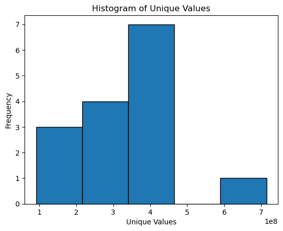

#### Conditions Histogram
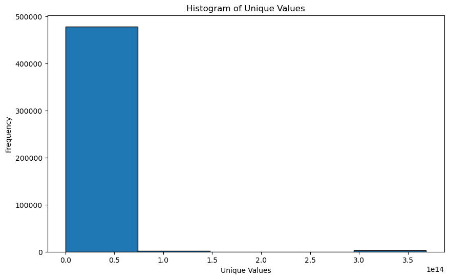

#### Medications Code Histogram
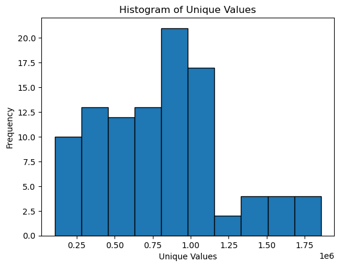

#### Medications ReasonCode Histogram
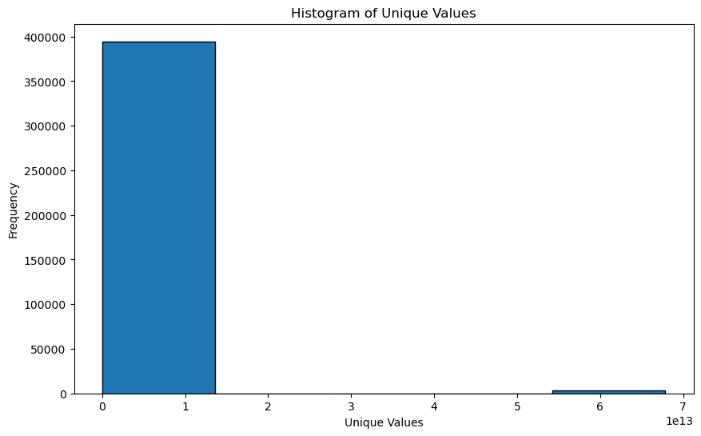

#### Immunizations Histogram
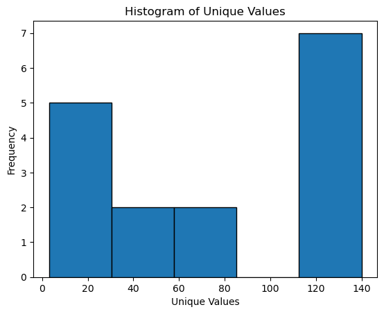

#### Encounters Code Histogram
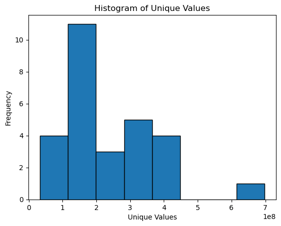

#### Encounters ReasonCode Histogram
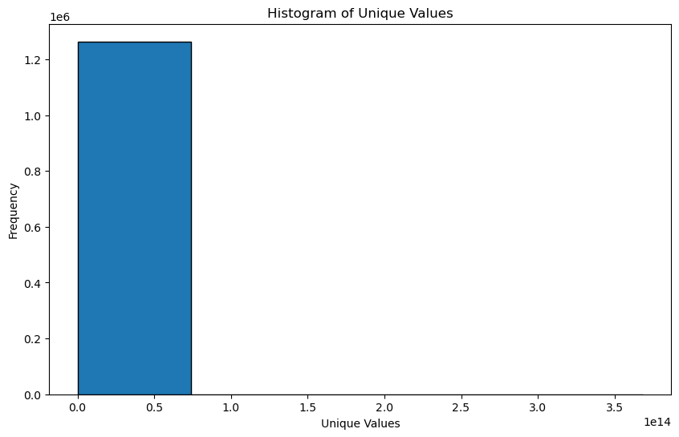

#### Careplans Histogram
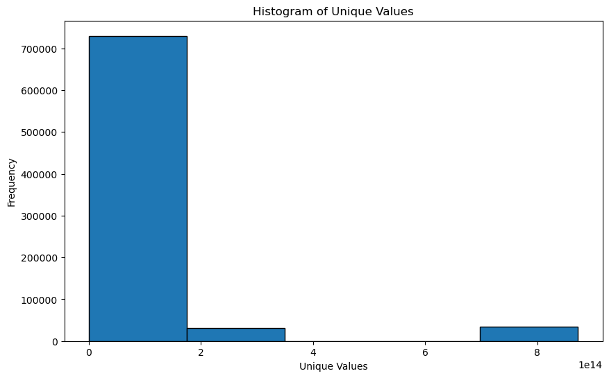

#### Patient Correlation Matrix
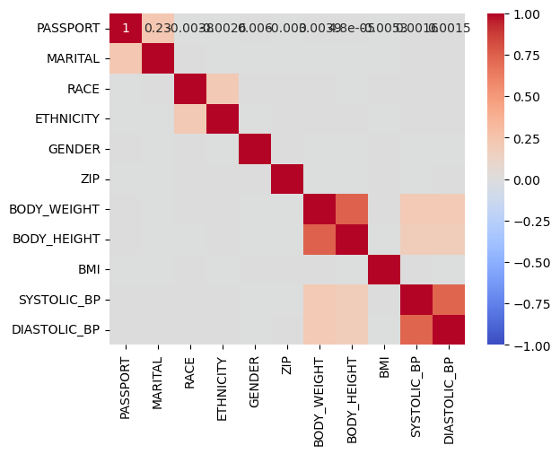

#### All Data Correlation Matrix
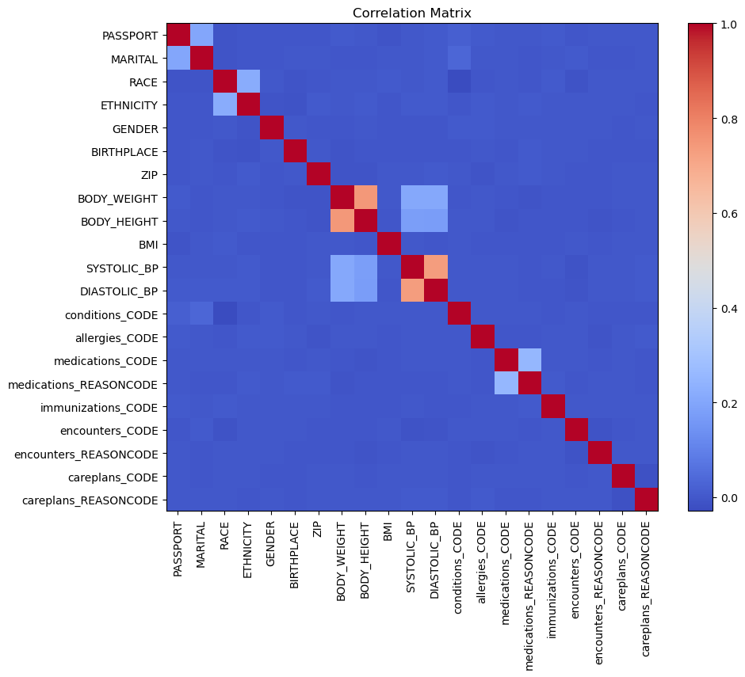

#### Patient Scatter Plot
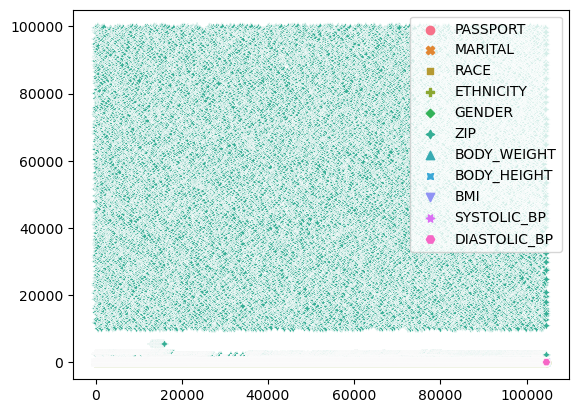

#### All Data Pair Plot
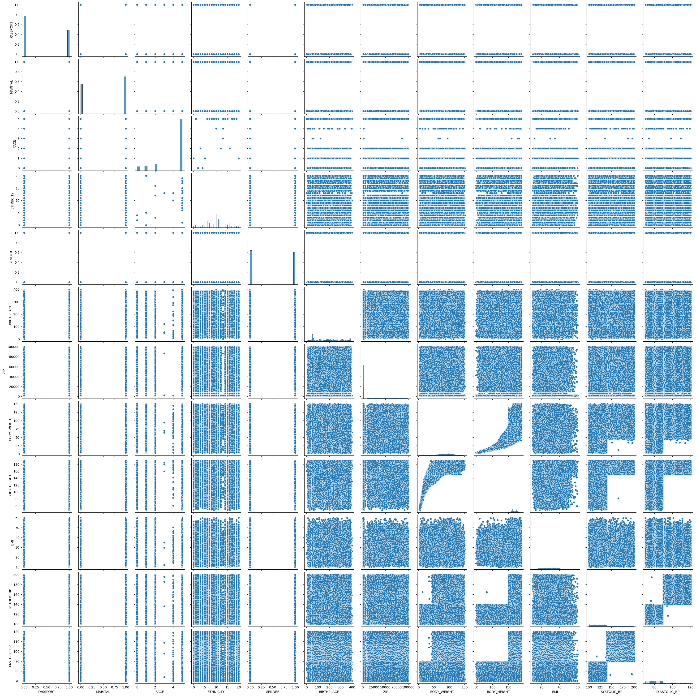

### Ongoing Analysis
As we continue to examine the data, our focus will be on using the ensemble method to gain a deeper understanding of the key features. This ongoing analysis will guide us towards making more accurate predictions and uncovering valuable insights from our data.

## Baseline Model Evaluation and Feature Importance

During our inital analysis we had a fairly low accuracy so our next course of action was to find the important features in our two models. Below are the reports detailing the accuracy scores from different aspects of our models:

### Patients Model Report
This report reflects the accuracy scores and feature importance for the model focusing on patient data.

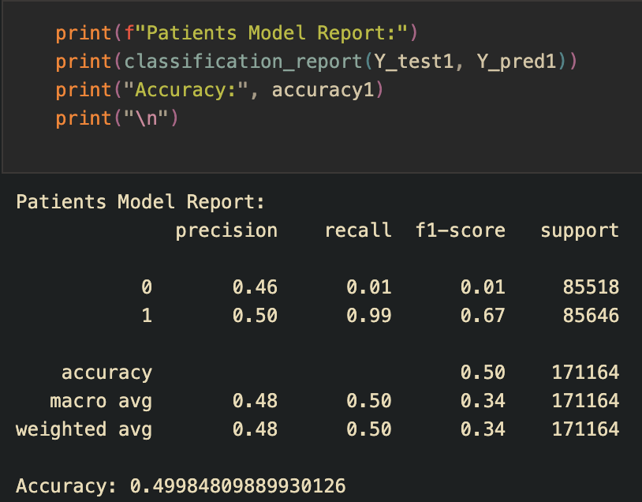

### Medications/CarePlans Model Report
This report shows the accuracy scores for the model that analyzes the relationship between medications, care plans, and lung cancer likelihood.

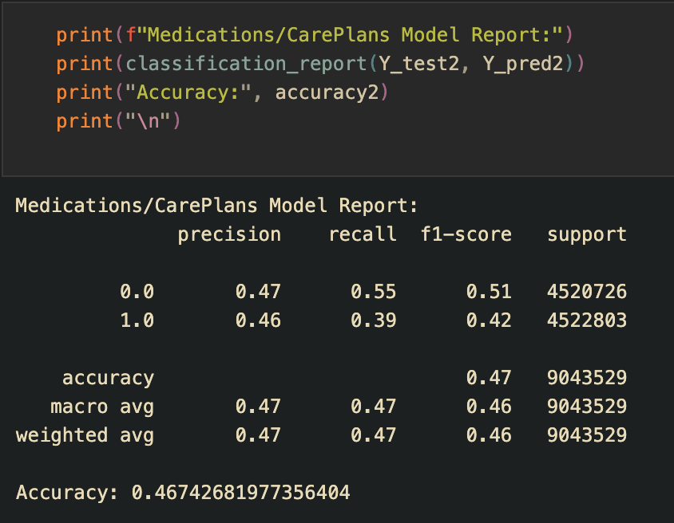

### Allergies/Immunizations/Encounters Model Report
Here we have the accuracy scores for the model examining the impact of allergies, immunizations, and medical encounters on lung cancer likelihood.

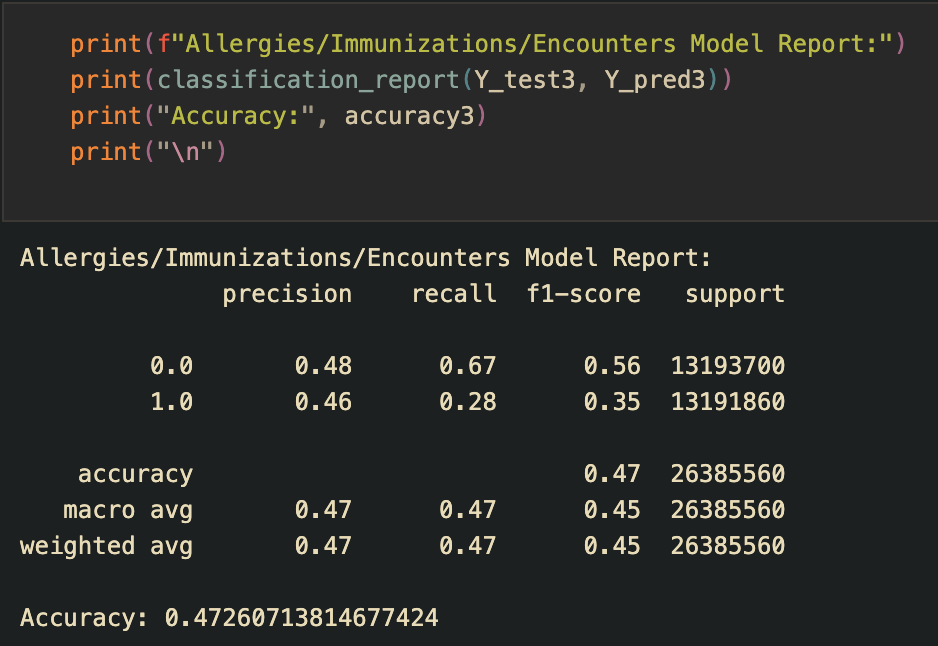

### Analysis of Important Features
From our analysis using Logistic Regression models, we identified key features that significantly influence the prediction of lung cancer likelihood. These important features include Age, Medications_Code, Allergies_Code, and Encounters_Code. The importance of these features was determined based on the coefficients in the Logistic Regression model, which reflect the strength and direction of the relationship between each predictor and the target value of lung cancer likelihood.

### Coefficients of the Models
The coefficients from our Logistic Regression models are as follows:
- **Model 1 Coefficients (M1):**
[[-0.49817227 -0.51607132 -0.09014324 -0.07776971 -0.47747404  0.02547673
  -0.01950067  0.02857654  0.00519281  0.00408341  0.01273696 -0.00836325
   0.39176771 -0.08342518  0.03076314]]
- **Model 2 Coefficients (M2):**
[[ 0.02831056  0.04458448  0.17357429 -0.17208068 -0.0347646 ]]
- **Model 3 Coefficients (M3):**
[[ 6.39293215e+09 -2.67621402e+03  5.13915011e+08 -2.78087108e+10
  -1.89094047e+10]]

These coefficients provide insight into how each variable influences the model's predictions, guiding our understanding of feature importance in lung cancer likelihood prediction.

### XGBoost Model Analysis
Our analysis extended to the use of XGBoost models, which helped us identify additional important features. These features were pivotal in predicting lung cancer likelihood:

- **Important Features Identified by XGBoost Models**:
  - Diastolic_BP
  - Systolic_BP
  - Ethnicity
  - Race
  - Age
  - Medications_Code
  - Allergies_Code
  - Immunizations Code

Visual representations of feature importance from the XGBoost models are shown below:
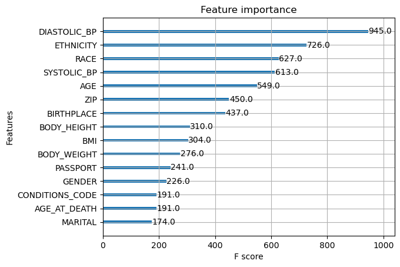

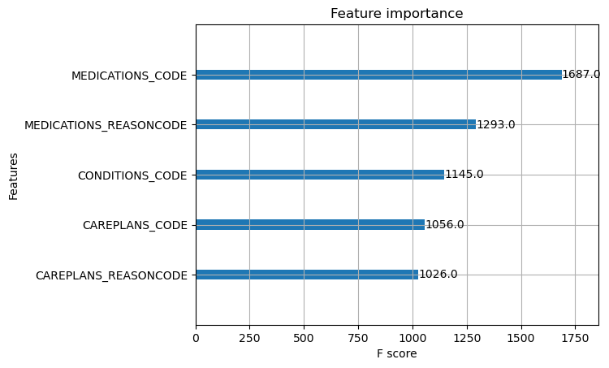

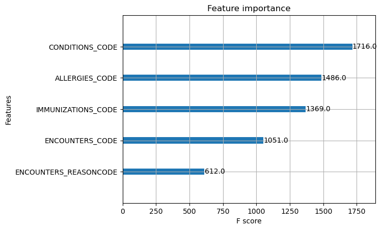

### Integrating Insights from Different Models
We observed an overlap in some of the important features identified by both Logistic Regression and XGBoost models, specifically in Age, Medications, and Allergies. Leveraging these insights, we combined the significant features from both model types to train a new Logistic Regression model.

### Dataset Management and Model Training
Our dataset size expanded significantly as we merged different files, reaching a volume of [72,000,000, 9] at one point. However, due to system limitations, we had to scale back, particularly on the initial patient data. The final merged dataset size was [207,555,295, 9].

To manage this large dataset, we divided it into 85 parts and focused on training the model on 5 segments that had both cancer and non-cancer patients. This approach allowed us to use SMOTE and train the data on equal parts Cancer and non Cancer. Below are the 5 separate models and how they scored:

Model 1 Report:

               precision    recall  f1-score   support
           0       0.91      0.71      0.80    976748
           1       0.76      0.93      0.83    955844
    accuracy                           0.82   1932592
   
   macro avg       0.83      0.82      0.81   1932592

weighted avg       0.83      0.82      0.81   1932592

Accuracy on Test Set 1: 0.8156884639903301

Model 2 Report:

               precision    recall  f1-score   support
           0       0.66      0.81      0.73    973495
           1       0.75      0.57      0.65    959097
    accuracy                           0.69   1932592
   
   macro avg       0.70      0.69      0.69   1932592

weighted avg       0.70      0.69      0.69   1932592

Accuracy on Test Set 2: 0.6920622666346544

Model 3 Report: 

              precision    recall  f1-score   support
           0       0.60      0.70      0.64    966570
           1       0.63      0.53      0.58    966022
    accuracy                           0.61   1932592
   
   macro avg       0.61      0.61      0.61   1932592

weighted avg       0.61      0.61      0.61   1932592

Accuracy on Test Set 3: 0.6117494018396019

Model 4 Report:

               precision    recall  f1-score   support
           0       0.71      0.73      0.72    973061
           1       0.72      0.70      0.71    959531
    accuracy                           0.72   1932592
   
   macro avg       0.72      0.72      0.72   1932592

weighted avg       0.72      0.72      0.72   1932592

Accuracy on Test Set 4: 0.7157729101641733

Model 5 Report:

               precision    recall  f1-score   support
           0       1.00      1.00      1.00   1932398
           1       0.00      0.00      0.00       194
    accuracy                           1.00   1932592
   
   macro avg       0.50      0.50      0.50   1932592

weighted avg       1.00      1.00      1.00   1932592

Accuracy on Test Set 5: 0.999899616680603

After we trained each separately we used an ensembled prediction to see how the combined model will preform shown below:

Combined Model Report:

               precision    recall  f1-score   support
           0       0.71      0.94      0.81    976748
           1       0.91      0.62      0.74    955844
    accuracy                           0.78   1932592
   
   macro avg       0.81      0.78      0.77   1932592

weighted avg       0.81      0.78      0.77   1932592

Accuracy on Combined Test Sets: 0.780578621871559

## Model Evaluation and Improvement

### Evaluation Methodology
Our solution's evaluation involved a multi-faceted approach:
- We began by using feature importance from logistic regression and XGBoost models to determine the most impactful features.
- Our strategy included training 5 logistic regression models, each incorporating instances of both cancer and non-cancer patients. This approach allowed us to synthetically augment the dataset and train our models more effectively.
- After training each model separately, we combined them to achieve a more accurate overall prediction.

### Evaluation Metrics Used
We employed various evaluation metrics to assess model performance, including:
- Precision
- Recall
- F1-score
- Macro average
- Weighted average
- Accuracy

### Baseline Model and Comparison
- Our baseline model was a Logistic Regression model, serving as a simple yet effective benchmark for our dataset.
- Our improved models outperformed the baseline by approximately 30%, indicating significant enhancement in prediction accuracy.

### Additional Model Evaluations
- We initially experimented with an XGBoost model, but encountered issues with 100% accuracy due to a coding error in normalization.
- Upon correcting the issue, we focused on feature importance to enhance our logistic regression model, resulting in an overall accuracy improvement of around 30%.

### Error Analysis and Future Improvements
- In our error analysis, we identified that certain features like 'Careplans' were not as effective. Other less valuable features included AGE_AT_DEATH, MARITAL, GENDER, PASSPORT, BMI, BODY_WEIGHT, and BODY_HEIGHT.
- We employed '.coef_' in Logistic Regression and '.plot_importance' in XGBoost for evaluating feature relevance, guiding our feature selection process.
- The decision to refine our feature set was data-driven, relying on model-specific metrics to determine feature importance.

## Conclusion

### Reflections on Project Outcomes
- Our project saw effective use of feature selection, enhancing the accuracy of our Logistic Regression model by approximately 30%.
- We attribute this success to the integration of key features from both logistic regression and XGBoost models. This helped in reducing noise and improving model focus.
- To address dataset imbalance, we implemented SMOTE, further aiding in model accuracy.

### Learning and Future Directions
- We learned that the careful selection and omission of features play a crucial role in model performance. Another thing we learned is the importance of having a powerful machine to handle large datasets. We encountered several issues with system limitations, which impacted our ability to train and test our models effectively. This experience underscores the need for a robust computing environment to support large-scale machine learning projects.
- For future work, we aim to explore other modeling techniques and parameter tuning methods to continue enhancing our model's predictive capabilities. We would also like to successfully use XGBoost not only for feature importance but also for model training and prediction.

### Data-Driven Decisions
- All decisions throughout the project were driven by data insights, particularly using feature importance metrics to streamline our model's focus. This approach underscores our commitment to a data-centric methodology in our machine learning endeavors.

### Team Collaboration
- Our team maintained a consistent schedule of 2-3 meetings per week throughout the project. These sessions were crucial for brainstorming, collaboration, and joint problem-solving.
- The majority of the code was developed collaboratively during these meetings. Only a small portion of the code was written individually, ensuring that all team members had a comprehensive understanding of the project's progress and direction.
